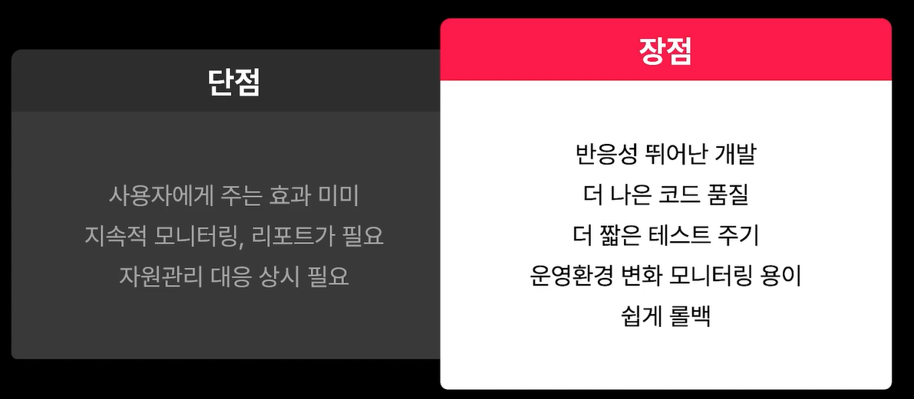

[TOC]

## CI

- 수정사항 반영

- 자동으로 테스트 수행
  - 빌드 여부
  - 통합 테스트
  - 유닛 테스트

- 이상 있을 시 에러 보고

## CD

- 정적 배포
  - 순수 react, 번들 서빙만 함
  - ex) AWS Cloudfront + S3
- 동적 배포
  - Next.js
    - .next/cache: 캐시된 이미지, 빌드캐시
    - .next/server/pages: HTML & JS entry point, server 가 선 렌더링
    - .next/server/chunks: 어플리케이션 내 공통사용되는 js
    - .next/static/chunks/pages: 해당 라우트 접근 시 로드될 js 파일
    - .next/static/css: global css 파일
  - ex) EC2 인스턴스 구축 후 빌드된 next.js 이미지를 가져와서 도커 컨테이너 실행

### 다양한 배포 환경

호스팅 선택시 고려사항

1. 고급 Nextjs 기능 지원 - ISR, middleware, serveless

2. 구성 및 운영 난이도 - 개발자 경험/비용/확장성
3. 인프라 구성 및 문제 시의 지원 여부 - 보안규정/SSO통합/고객지원

#### Vercel

- Vercel: Front as a Serveice

- 손쉽게 Frontend를 빌드 & 배포
- Github PR에 대해 Pre-deploying 제공
  - 상용 배포 이전 디자인 검수
  - 테스트 환경
- Nextjs 고급 기능 전부 지원 / 대시보드, 분석 툴도 제공

#### Netlify

다양한 FE 프레임워크 지원

자체 CDN, Next.js Serverless 기능, ISR, middleware, Image optimization 지원

#### AWS Amplify

관련 모듈들이 AWS로 운영될 경우 선택 고려

배포 워크플로우를 보다 효과적으로 제어

기존 클라우드 환경 유지

앱을 세밀하게 제어

Next.js 앱 호스팅 위한 솔루션 제공

인프라 설정 및 유지 관리 감소 가능

개발자 경험은 상대적으로 부정적

#### Node.js self hosting

직접 Next.js 앱을 완전히 제어

유지관리에 대한 책임을 원하는 경우

- AWS EC2, Azure App Service, Digital Ocean, Heroku, Personal hosting server

## CI/CD 파이프라인 구축



### CI/CD 플랫폼

- Jenkins
  - 대규모 개발그룹에서 customization이 필요한 도구가 필요할 시
  - 장점
    - 오픈소스, 대규모 확장 가능, 커스터마이징 강력
  - 단점
    - 구성 복잡, 이해 어렵
- Github Action
  - 소~중규모 제품/팀의 프로덕트 개발 프로세스
  - 공용 repo 2000분 무료
  - private는 분당 가격
  - 장점
    - GitHub 내장이라 설치 불필요
    - 간단한 인터페이스
    - 다양한 기능, 옵션
    - 코드보안을 위한 처리 구성
    - self hosted runner 구동으로 비용 절감 가능
  - 단점
    - 대규모 확장 시 비용의 문제
    - 커스터마이징의 한계가 존재
- TravisCI, CircleCI, Azure Pipeline 등등..

### Github Action

#### Workflow

1개 이상의 job을 수행하는 설정가능한 자동화 프로세스

YAML을 이용, `.github/workflows` 디렉토리에 정의

정의된 워크플로우를 다른 워크플로우에서 재사용 가능

```basic
- name: (opt) 리포지토리 Actions 탭에 보여질 이름
- run-name: (opt) 리포지토리 Actions 탭에 보여질 이름
- on: Trigger 정의
- jobs: Worflow 안의 job 정의
	- <JOB_NAME>: JOB Name 기준으로 job의 수행항목 정의
	- runs-on: job이 수행될 VM 정의
	- steps: job 아래에서 수행될 task 목록, shell script 이거나 분리된 github action
		- uses: 사용할 action
		- run: 수행할 bash script
```

#### Event

워크플로우가 동작하게 트리거 시키는 책티비티

Github에서 보내주거나 사용자가 발생 가능

워크플로우를 트리거링 시키는 이벤트 목록: https://docs.github.com/en/actions/using-workflows/events-that-trigger-workflows

자주 사용되는 이벤트

- push: 커밋/태그 푸시
- pull_request: PR 오픈 시
- create: 브랜치/태그를 새로 생성 했을 때
- issues: 이슈를 생성/삭제/수정 했을 때

#### Job

같은 러너에서 순차적으로 실행되는 step의 집합

하나의 워크플로우 내에 여러개의 job 정의 가능 - job1, job2를 정의

jobs 내에서 병렬 수행되거나 needs 옵션에 따라 순서대로 실행 가능

- `needs` 옵션에 명시된 다른 job이 종료된 이후에 수행 가능

Job은 if 속성을 통해서 job의 실행 여부를 통제 가능

- branch가 main인 경우에만 수행 `if: github.ref_name == 'main'`
- 가장 최근 커밋 메시지에 test가 들어가지 않은 경우에만 수행 `if: ${{ !contains(github.event.head_commit.message, 'test') }}`

Matrix strategy

- 하나의 job 정의 내에서 여러가지 변수의 조합을 사용한 실행
- 여러 os 환경이나 언어 버전 등을 정의 가능
- 여러개의 matrix를 정의해서 사용도 가능
- 중복된 코드를 줄이고 효율적으로 사용 (for 루프처럼 씀)

```yaml
jobs:
	test-jobs:
		runs-on: ubuntu-latest
		strategy:
			matrix:
				node-version: [14, 16]
        steps:
        	- use: actions/setup-node@v3
        	  with:
        	      node-version: ${{ matrix.node-version }}
```

#### Step

Job 안에서 순차적으로 수행되는 단계

run 속성: 하나의 단순한 bash sehll command 수행

uses 속성: 다른 github 액션을 수행

`-` 기호를 사용하여 list 형식으로 구성하여 나열

```yaml
name: Build and Test
on: push
jobs:
	test:
		runs-on: ubuntu-latest
		steps:
			- uses: actions/checkout@v3
			- run: npm ci
			- run: npm run build
			- run: npm test
```

job 안에서 step간에는 서로간의 데이터 공유 가능

- 같은 러너에서 수행되기 때문

출력 매개변수를 통해서 다음 단계로 전달 가능

- 변수 이름과 값을 `{name}={value}`형태로 `$GITHUB_OUTPUT`환경변수에 전달
- 변수 read: context 문법인 `steps.<step_id>.outputs.<output_name>`사용

```yaml
# write foo and read foo
name: Accessing var foo
on: push
jobs:
	foobar:
		runs-on: ubuntu-latest
		steps:
			- id: foo
			  run: echo "foo=bar" >> "$GITHUB_OUTPUT"
			- run: echo ${{ steps.foo.outputs.foo }}
```

step도 if 통제 가능

```yaml
steps:
	- if: steps.rand.outputs.num == 0
	  run: echo "0"
```

기본적으로는 현재 step 실패 시 다음 step을 수행하지 않음

`continue-on-error` 속성이 `true`로 되어 있으면 남은 단계를 이어서 수행

```yaml
steps:
  - id: go-over
    continue-on-error: true
    run: exit 1
  - run: echo "always Executed"
```

이전단계의 결과에 상관없이 항상 수행되어야 되는 단계

- job의 실행경과 통보같은 처리 수행시
- if 속성에 `always()` expression 적용

```yaml
steps:
  - if: ${{ always() }}
    run: echo ${{ steps.random.outcome }}
```

#### Action

Custom Application for Github Action platform

Github Action을 구성하는데 시간/난이도를 낮춰줌

Action marketplace: https://github.com/marketplace?type=actions

자주 사용되는 action

- action/checkout@v3: 코드를 runner로 내려받을 때
- actions/setup-node@v3: Node.JS 환경 구성
- mikefarah/yq@v4.35.1: yaml query 사용시, jq와 유사
- docker/build-push-action@v4: Docker images build & push to registry
- softprops/action-gh-release@v2: Github release 구성

#### Runner

workflow가 실행되는 가상 서버

hosted runner

- github이 제공하는 Runner
- windows, macOS, linux OS 제공
- public repo는 월 2천분 사용 가능

self-hosted runner

- 직접 runner 인스턴스 구성
- run on k8s: https://github.com/actions/actions-runner-controller
- 공식 메뉴얼: https://docs.github.com/en/actions/hosting-your-own-runners/managing-self-hosted-runners/about-self-hosted-runners

### CI Worflow

```yaml
name: CI
on: pull_request
jobs:
	ci-job:
	  runs-on: ubuntu-latest
	  steps:
		- uses: actions/checkout@v3
		- run: npm ci
		- run: npm run build			
		- run: npm test
    add-comment:
      runs-on: ubuntu-latest
      needs: ci-job
      if: always()
      permission:
        issues: write
        pull-request: write
      steps:
        - name: Comment to PR (성공)
          env:
            RESULT: ${{needs.ci-job.result}}
          if: ${{env.RESULT}} == 'success'
          uses: actions/github-script@v6
          id: my-script
          with:
            script: |
              github.rest.issues.createComment({
                issue_number: context.issue.number,
                owner: context.repo.owner,
                repo: context.repo.repo,
                body: "CI Passed"
              })
        - name: Comment to PR (실패)
          env:
            RESULT: ${{needs.ci-job.result}}
            if: ${{env.RESULT}} == 'failure'
            uses: actions/github-script@v6
            id: my-script2
            with:
              script: |
                github.rest.issues.createComment({
                  issue_number: context.issue.number,
                  owner: context.repo.owner,
                  repo: context.repo.repo,
                  body: "CI failed"
                })
          
```

### CD Workflow

#### 준비사항

Install Vercel CLI: `npm i -g vercel`

Run vercel login: `vercel login`

Run vercel link: `vercel link` # 새 project 생성을 하거나 기존 project와 link

생성된 .vercel/project.json 파일

- orgId와 projectId를 구해 VERCEL_ORG_ID, VERCEL_PROJECT_ID 로 github secret에 추가

VERCEL_TOKEN

- https://vercel.com/guides/how-do-i-use-a-vercel-api-access-token

- 위 링크 참조하여 Vercel Access token을 받아온다

#### CD.yaml

```yaml
name: Vercel Production Delivery
env:
  VERCEL_ORG_ID: ${{ secrets.VERCEL_ORG_ID }}
  VERCEL_PROJECT_ID: ${{ secrets.VERCEL_PROJECT_ID }}
on:
  push:
    branches:
      - main
jobs:
  delivery-production:
    runs-on: ubuntu-latest
    steps:
      - uses: actions/checkout@v3
      - name: Install Vercel CLI
        run: npm install --global vercel@latest
      - name: Pull Vercel Environment Information
        run: vercel pull --yes --environment=production --token=${{ secrets.VERCEL_TOKEN }}
      - name: Build Project Artifacts
        run: vercel build --prod --token=${{ secrets.VERCEL_TOKEN }}
      - name: Deploy Project Artifacts to Vercel
        run: vercel deploy --prebuild --prod --token=${{ secrets.VERCEL_TOKEN }}
```

#### Deploy-Preview.yaml

```yaml
name: Vercel Production Delivery
env:
  VERCEL_ORG_ID: ${{ secrets.VERCEL_ORG_ID }}
  VERCEL_PROJECT_ID: ${{ secrets.VERCEL_PROJECT_ID }}
on:
  pull_request:
    types: [opened, reopened, edited]
jobs:
  deploy-preview:
    runs-on: ubuntu-latest
    outputs:
      deploymentUrl: ${{ steps.deploy-step.outputs.deploymentUrl }}
    steps:
      - uses: actions/checkout@v3
      - name: Install Vercel CLI
        run: npm install --global vercel@latest
      - name: Pull Vercel Environment Information
        run: vercel pull --yes --environment=preview --token=${{ secrets.VERCEL_TOKEN }}
      - name: Build Project Artifacts
        run: vercel build --prod --token=${{ secrets.VERCEL_TOKEN }}
      - name: Deploy Project Artifacts to Vercel
        id: deploy-step
        run: |
          vercel deploy --prebuilt --token=${{ secrets.VERCEL_TOKEN }} >deployment-url.txt
          echo "deploymentUrl=$(cat deployment-url.txt)" >> $GITHUB_OUTPUT
  add-comment:
      runs-on: ubuntu-latest
      needs: deploy-preview
      if: always()
      permission:
        issues: write
        pull-request: write
      steps:
        - name: Comment to PR (성공)
          env:
            DEPLOYMENT_URL: ${{needs.deploy-preview.outputs.deploymentUrl}}
            RESULT: ${{needs.deploy-preview.result}}
          if: ${{env.RESULT}} == 'success'
          uses: actions/github-script@v6
          id: my-script
          with:
            script: |
              github.rest.issues.createComment({
                issue_number: context.issue.number,
                owner: context.repo.owner,
                repo: context.repo.repo,
                body: "Deployed at ${{env.DEPLOYMENT_URL}}"
              })
        - name: Comment to PR (실패)
          env:
            DEPLOYMENT_URL: ${{needs.deploy-preview.outputs.deploymentUrl}}
            RESULT: ${{needs.deploy-preview.result}}
          if: ${{env.RESULT}} == 'failure'
          uses: actions/github-script@v6
          id: my-script2
          with:
            script: |
              github.rest.issues.createComment({
                issue_number: context.issue.number,
                owner: context.repo.owner,
                repo: context.repo.repo,
                body: "Deploy-preview failed"
              })
```

