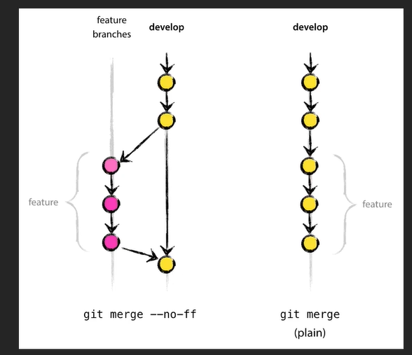
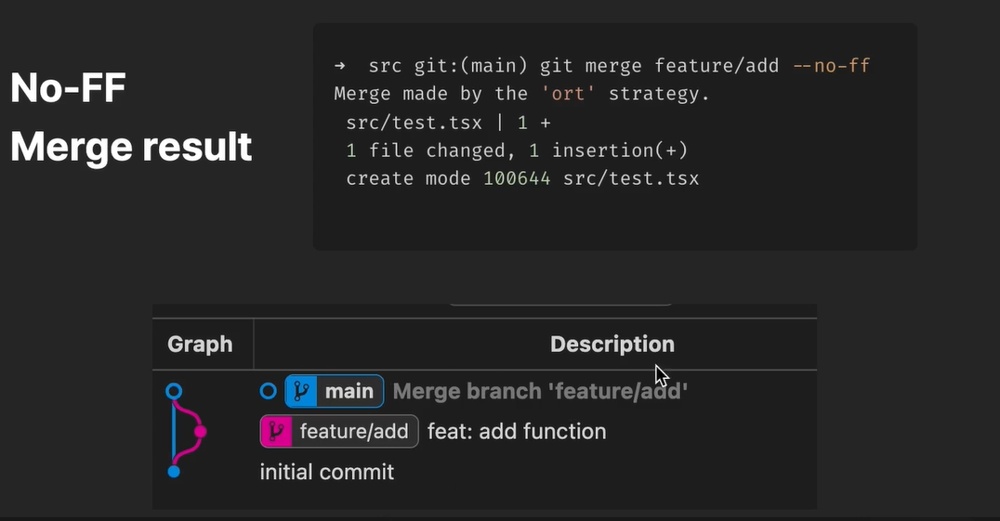
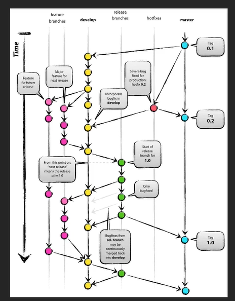
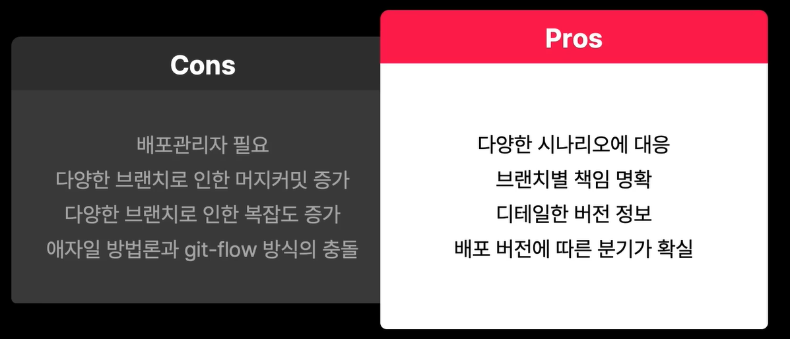
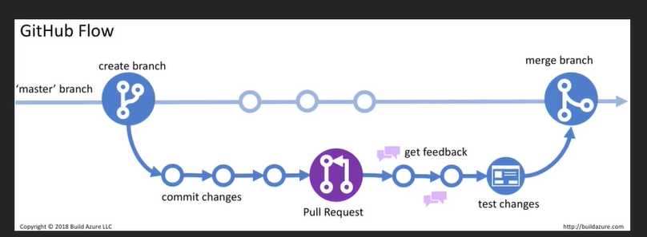
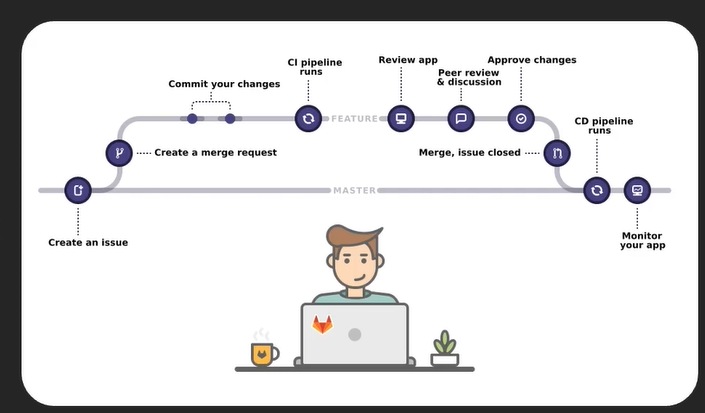

## Merge

### (fast-foward) merge

- 커밋히스토리 변경 없음
- 이전 피쳐 브랜치의 커밋 내용 유실 가능성

### No-ff merge

- fast-forward 없음
- 새로운 머지 커밋 발생
- 장점 - 기록과 순서를 보존
- 단점 - 새로운 머지커밋은 수많은 병합 커밋으로 인해서 복잡, 일부 디버깅이 복잡해짐





### Squash Merge

Rebase나 merge 이전에 Feature 브랜치의 모든 commit을 sqaush하여 하나의 commit으로 병합

메인 브랜치의 히스토리를 리니어하게 관리 가능 vs 피쳐의 개발과정동안의 디테일 상실

전체 피쳐를 하나의 커밋으로 격리 vs 기록적인 이유로 unsquash 상태를 유지해야할 수도

FF머지와 함께 사용 시 유리

## Rebase

작업 내용을 다른 브랜치에서 재 생성

같은 수정사항을 가지고 있는 모든 이전 커밋에 대해서 신규 커밋을 생성

복잡한 기록을 간소화 vs 피쳐의 컨텍스트가 숨겨질 수 있다.

단일 커밋 조작의 용이함 vs 팀으로 작업시 위험성

### Interactive rebase

- Chaining commit에 대해 edit/delete/squash 같은 옵션을 적용해서 보다 편리하게 rebase를 진행

- 새로운 SHA1을 생성하기 때문에 remote branch로 push하기 이전에 진행
- 로컬에서 remote 푸시전 commit들 정리할 때 사용한다.

`git rebase -i HEAD~n`: HEAD에서부터 n번째까지 interactive 진행

`git rebase -i 4aa065`: 4aa065 이전까지의 커밋들에 대해서 interactive 진행

- pick: 커밋을 그대로 사용
- reword: 커밋 메시지 수정
- edit: 커밋 메시지 + 내용 수정
- squash, fixup: 해당 커밋을 이전 커밋과 합침 (bash 기준 squash 준 애와 위에가 합쳐짐)
  - squash: 커밋들의 메시지가 합쳐짐
  - fixup: 이전 커밋의 메시지만 남음
- drop: 해당 커밋 버림

## Stash

임시저장

```bash
// 현재 작업 파일 스태시에 저장
git stash

// untracked 변경사항도 스태시에 저장
git stash --all

// staging 영역의 파일은 제외하고 저장
git stash --keep-index

// 특정 이름으로 스태시 저장
git stash save NAME

// stash list
git stash list

// stash 한 것 새로운 branch에 반영해서 테스트 -> 얘를 기존 브랜치에 merge
git stash branch NAME

// 가장 최근 stash 가져오기
git stash apply

// n번 stash 가져오기
git stash apply stash@{n}

// n번 stash 지우기
git stash drop stash@{n}

// stash 모두 지우기
git stash clear
```

## Reset

로컬의 수정사항을 제거

- 혼자 작업하면서 커밋 히스토리 정리할 때
- 불필요한 로컬 수정 제거시

```bash
--soft : 변경사항 제거, 수정된 이력들은 staged로 이동
--mixed: 변경사항 제거, 수정된 이력들은 unstaged로 이동
--hard: 변경사항 제거, 수정된 이력들 삭제
```

## Revert

원복: Reset과는 다르게 commit 추가

- 협업시

## 형상관리전략

### Git flow

### 방법



배포 안정 형상

- master branch: 제품 배포 가능한 브랜치

개발

- feature branch: 신규 개발 진행
- feature 완료 후 develop branch에 머지

릴리즈 스테이징

- develop: 출시되지 않은 준비된 개발 항목들
- 다음 릴리즈는 develop에서 분기되어서 진행

긴급 수정사항

- Hotfix branch: 출시된 부분의 수정사항이 반영됨
- 기존 개발중 코드에 영향을 미치지 않도록

### 장단점



### Github flow

간단함, PR 활용



### Gitlab flow

단순, Git flow + issue tracking



Feature 머지 즉시 배포할 수 없는 경우

- 릴리즈 타이밍을 결정할 수 없을 때
- 운영시간 외에 머지가 발생되는 경우

Production 브랜치 따서 해당 브랜치를 배포용으로 씀


